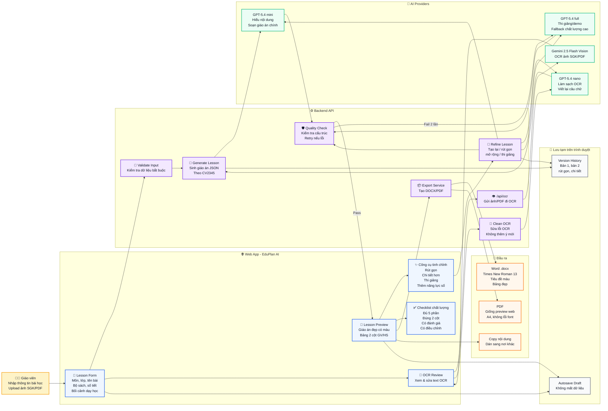
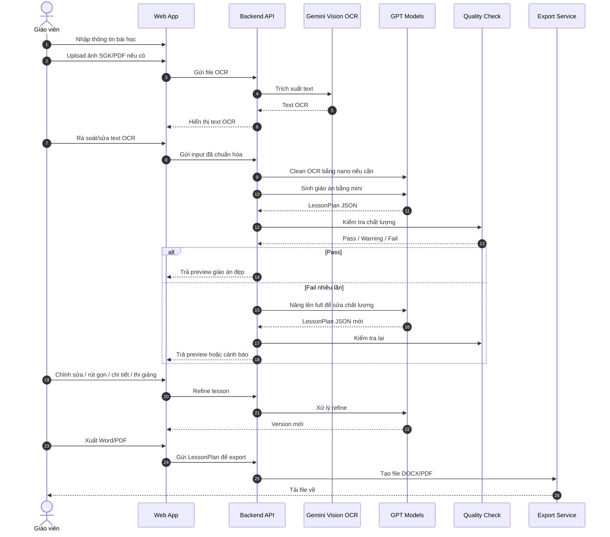

# So Do Tong Quan EduPlan AI

File nay mo ta cau truc tong quan cua cong cu EduPlan AI. Co the xem truc tiep tren GitHub/Markdown viewer co ho tro Mermaid.

## 1. So Do Tong Quan De Hieu

## 2. Luong Hoat Dong Chinh

## 3. Cach Doc So Do

- Mau vang: nguoi dung giao vien.
- Mau xanh duong: giao dien web ma giao vien thao tac.
- Mau tim: backend xu ly nghiep vu, validate, export, quality check.
- Mau xanh la: cac model AI/OCR ben ngoai.
- Mau cam: file dau ra.
- Mau xam: du lieu luu tam tren trinh duyet.

## 4. Ket Luan Ngan Gon

EduPlan AI gom 5 lop chinh:

1. Lop nhap lieu: giao vien dien form va upload tai lieu.
2. Lop xu ly AI: OCR, lam sach text, sinh giao an, refine.
3. Lop kiem tra chat luong: dam bao dung CV2345 va dung 2 cot GV/HS.
4. Lop hien thi: preview giao an dep, co mau sac va co the chinh sua.
5. Lop xuat file: tao DOCX/PDF dep, giu format on dinh khi tai ve.
